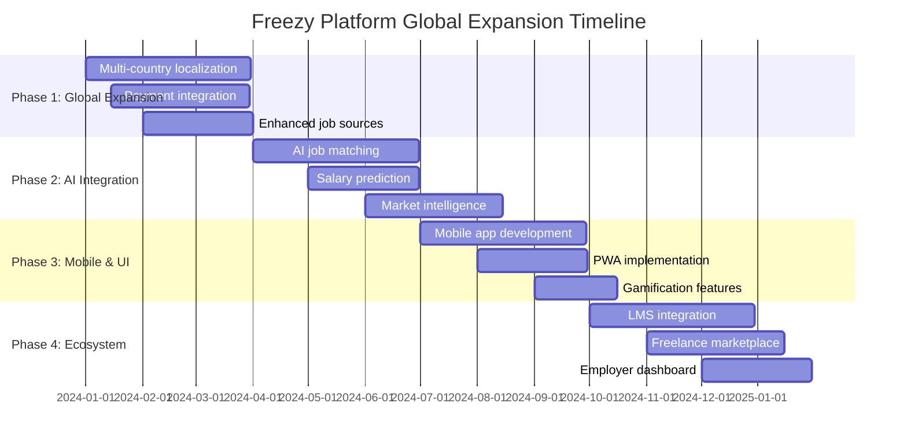
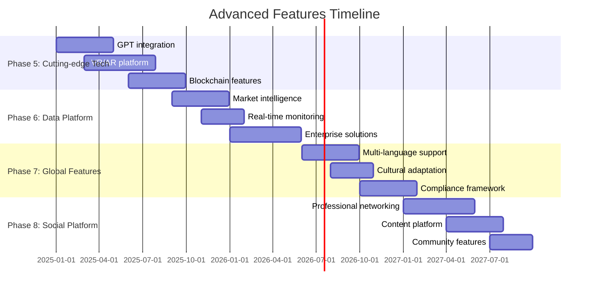

# 🚀 Freezy Platform - Global Expansion Roadmap

## 📋 Table of Contents

- [🎯 Executive Summary](#-executive-summary)
- [🌍 Phase 1: Global Market Expansion](#-phase-1-global-market-expansion-0-3-months)
- [🤖 Phase 2: AI & Machine Learning Integration](#-phase-2-ai--machine-learning-integration-3-6-months)
- [📱 Phase 3: Mobile & Modern Interfaces](#-phase-3-mobile--modern-interfaces-6-9-months)
- [🔗 Phase 4: Ecosystem Expansion](#-phase-4-ecosystem-expansion-9-12-months)
- [🚀 Phase 5: Cutting-Edge Technology](#-phase-5-cutting-edge-technology-year-2)
- [📊 Phase 6: Data & Intelligence Platform](#-phase-6-data--intelligence-platform-year-2-3)
- [🌟 Phase 7: Global Platform Features](#-phase-7-global-platform-features-year-3)
- [📱 Phase 8: Social & Community Features](#-phase-8-social--community-features-year-3-4)
- [💰 Revenue Expansion Strategy](#-revenue-expansion-strategy)
- [🔧 Technical Architecture Evolution](#-technical-architecture-evolution)
- [📈 Implementation Timeline](#-implementation-timeline)
- [🎯 Success Metrics](#-success-metrics)
- [🏆 Final Vision](#-final-vision-freezy-global)

---

## 🎯 Executive Summary

**Freezy Platform** is positioned to become the world's most intelligent career platform, transforming from a Pakistan-focused job board to a global career intelligence ecosystem. This roadmap outlines an 8-phase expansion strategy spanning 4 years, targeting 10M+ users across 50+ countries with $100M+ annual revenue.

### 🌟 Current State
- **18+ job sources** with 150+ daily jobs
- **Pakistan market leadership** with growing user base
- **Automated content pipeline** with 90%+ reliability
- **Tiered subscription model** generating sustainable revenue

### 🎯 Target State (4 Years)
- **Global career intelligence platform** serving 50+ countries
- **10M+ active users** with AI-powered personalization
- **1M+ daily job opportunities** from 500+ sources
- **Integrated learning ecosystem** with verified certifications
- **Enterprise solutions** for workforce planning
- **$100M+ annual revenue** from diversified streams

---

## 🌍 Phase 1: Global Market Expansion (0-3 Months)

### 🌐 Multi-Country Localization

#### Target Markets & Strategy
```javascript
const globalExpansion = {
  'Tier 1 Markets (Immediate)': {
    'India': {
      market_size: '$2.5B annually',
      payment_methods: ['Razorpay', 'Paytm', 'UPI'],
      job_sources: ['Naukri.com', 'Monster India', 'TimesJobs', 'Shine.com'],
      languages: ['Hindi', 'English', 'Tamil', 'Bengali'],
      currency: 'INR',
      compliance: 'Indian IT Act, GST'
    },
    'UAE': {
      market_size: '$800M annually',
      payment_methods: ['Network International', 'PayFort', 'Telr'],
      job_sources: ['Bayt.com', 'GulfTalent', 'Dubizzle Jobs', 'Naukrigulf'],
      languages: ['Arabic', 'English'],
      currency: 'AED',
      compliance: 'UAE Labor Law, VAT'
    },
    'Bangladesh': {
      market_size: '$400M annually',
      payment_methods: ['bKash', 'Rocket', 'Nagad'],
      job_sources: ['BDJobs.com', 'Chakri.com', 'Prothom Alo Jobs'],
      languages: ['Bengali', 'English'],
      currency: 'BDT',
      compliance: 'Bangladesh Labor Act'
    }
  },
  
  'Tier 2 Markets (3-6 months)': {
    'Malaysia': {
      market_size: '$600M annually',
      payment_methods: ['iPay88', 'MOLPay', 'GrabPay'],
      job_sources: ['JobStreet', 'Monster Malaysia', 'Recruit.net'],
      languages: ['Bahasa Malaysia', 'English', 'Mandarin'],
      currency: 'MYR'
    },
    'Nigeria': {
      market_size: '$1.2B annually',
      payment_methods: ['Paystack', 'Flutterwave', 'Interswitch'],
      job_sources: ['Jobberman', 'NgCareers', 'HotNigerian Jobs'],
      languages: ['English', 'Hausa', 'Yoruba', 'Igbo'],
      currency: 'NGN'
    },
    'Philippines': {
      market_size: '$500M annually',
      payment_methods: ['PayMaya', 'GCash', 'DragonPay'],
      job_sources: ['JobStreet Philippines', 'Kalibrr', 'BestJobs'],
      languages: ['Filipino', 'English'],
      currency: 'PHP'
    }
  }
}
```

#### Implementation Strategy

##### 🔧 Technical Implementation
```typescript
// Multi-tenant architecture for global expansion
interface CountryConfig {
  countryCode: string;
  currency: string;
  languages: string[];
  paymentProviders: PaymentProvider[];
  jobSources: JobSource[];
  compliance: ComplianceRules;
  localization: LocalizationConfig;
}

class GlobalPlatform {
  private countryConfigs: Map<string, CountryConfig>;
  
  async initializeCountry(countryCode: string): Promise<void> {
    const config = this.countryConfigs.get(countryCode);
    
    // Initialize localized services
    await this.setupPaymentGateways(config.paymentProviders);
    await this.configureJobSources(config.jobSources);
    await this.setupLocalization(config.languages);
    await this.configureCompliance(config.compliance);
  }
  
  async getLocalizedContent(countryCode: string, userId: string): Promise<Content> {
    const config = this.countryConfigs.get(countryCode);
    return await this.contentService.getLocalized(config, userId);
  }
}
```

##### 💳 Payment Integration
```python
# Global payment processing system
class GlobalPaymentProcessor:
    def __init__(self):
        self.payment_gateways = {
            'stripe': StripeGateway(),  # Global coverage
            'razorpay': RazorpayGateway(),  # India
            'paystack': PaystackGateway(),  # Africa
            'paymob': PaymobGateway(),  # Middle East
            'xendit': XenditGateway(),  # Southeast Asia
        }
    
    def process_payment(self, country_code, amount, currency, payment_method):
        gateway = self.get_optimal_gateway(country_code, payment_method)
        
        return gateway.process_payment({
            'amount': amount,
            'currency': currency,
            'payment_method': payment_method,
            'country': country_code,
            'compliance': self.get_compliance_rules(country_code)
        })
    
    def get_optimal_gateway(self, country_code, payment_method):
        # Smart gateway selection based on:
        # - Lowest fees
        # - Highest success rates
        # - Local preferences
        # - Compliance requirements
        pass
```

### 🔗 Enhanced Global Job Source Integration

#### Massive Source Expansion
```python
# Enhanced global job scraping system
class GlobalJobScraper:
    def __init__(self):
        self.global_sources = {
            'India': {
                'naukri': NaukriScraper(),
                'monster_india': MonsterIndiaScraper(),
                'timesjobs': TimesJobsScraper(),
                'shine': ShineScraper(),
                'indeed_india': IndeedIndiaScraper(),
                'linkedin_india': LinkedInIndiaScraper(),
                'glassdoor_india': GlassdoorIndiaScraper(),
                'foundit': FounditScraper(),
                'freshersworld': FreshersworldScraper(),
                'instahyre': InstahyreScraper()
            },
            'UAE': {
                'bayt': BaytScraper(),
                'gulftalent': GulfTalentScraper(),
                'dubizzle_jobs': DubizzleJobsScraper(),
                'naukrigulf': NaukriGulfScraper(),
                'indeed_uae': IndeedUAEScraper(),
                'linkedin_uae': LinkedInUAEScraper(),
                'monster_gulf': MonsterGulfScraper(),
                'laimoon': LaimoonScraper()
            },
            'Global_Remote': {
                'remoteok': RemoteOKScraper(),
                'weworkremotely': WeWorkRemotelyScraper(),
                'remote_co': RemoteCoScraper(),
                'flexjobs': FlexJobsScraper(),
                'toptal': ToptalScraper(),
                'gun_io': GunIOScraper(),
                'angel_list': AngelListScraper(),
                'stackoverflow_jobs': StackOverflowJobsScraper(),
                'github_jobs': GitHubJobsScraper(),
                'dribbble_jobs': DribbbleJobsScraper()
            },
            'Freelance': {
                'upwork': UpworkScraper(),
                'fiverr': FiverrScraper(),
                'freelancer': FreelancerScraper(),
                'guru': GuruScraper(),
                'peopleperhour': PeoplePerHourScraper(),
                'toptal_freelance': ToptalFreelanceScraper(),
                '99designs': NinetyNineDesignsScraper(),
                'designcrowd': DesignCrowdScraper()
            }
        }
    
    async def scrape_all_sources(self):
        """Scrape jobs from all global sources"""
        all_jobs = []
        
        for country, sources in self.global_sources.items():
            country_jobs = []
            
            for source_name, scraper in sources.items():
                try:
                    jobs = await scraper.scrape_jobs()
                    country_jobs.extend(jobs)
                    print(f"✅ {country} - {source_name}: {len(jobs)} jobs")
                except Exception as e:
                    print(f"⚠️ {country} - {source_name} failed: {e}")
            
            all_jobs.extend(country_jobs)
            print(f"🌍 {country} total: {len(country_jobs)} jobs")
        
        return all_jobs
```

#### Daily Harvest Projection
```
🌍 GLOBAL DAILY HARVEST PROJECTION:
═══════════════════════════════════════
🇵🇰 Pakistan Sources:      50+ jobs
🇮🇳 India Sources:        200+ jobs
🇦🇪 UAE Sources:          80+ jobs
🇧🇩 Bangladesh Sources:   60+ jobs
🇲🇾 Malaysia Sources:     70+ jobs
🇳🇬 Nigeria Sources:      90+ jobs
🇵🇭 Philippines Sources:  60+ jobs
🌐 Global Remote:         150+ jobs
💼 Freelance Platforms:   100+ jobs
📚 Courses:               50+ courses
🛠️ Tools:                 30+ tools
═══════════════════════════════════════
📊 TOTAL DAILY: 1,000+ RESOURCES
```

---

## 🤖 Phase 2: AI & Machine Learning Integration (3-6 Months)

### 🧠 Advanced AI Job Matching System

#### Intelligent Recommendation Engine
```python
# AI-powered job matching system
import tensorflow as tf
import numpy as np
from transformers import AutoTokenizer, AutoModel
import pandas as pd

class AIJobMatcher:
    def __init__(self):
        self.tokenizer = AutoTokenizer.from_pretrained('bert-base-uncased')
        self.model = AutoModel.from_pretrained('bert-base-uncased')
        self.job_embeddings = {}
        self.user_embeddings = {}
        
    def create_user_embedding(self, user_profile):
        """Create user embedding from profile data"""
        user_text = f"""
        Skills: {', '.join(user_profile.get('skills', []))}
        Experience: {user_profile.get('experience_years', 0)} years
        Education: {user_profile.get('education', '')}
        Preferences: {user_profile.get('job_preferences', '')}
        Location: {user_profile.get('location', '')}
        Salary Range: {user_profile.get('salary_range', '')}
        """
        
        inputs = self.tokenizer(user_text, return_tensors='pt', 
                               truncation=True, padding=True, max_length=512)
        
        with tf.no_grad():
            outputs = self.model(**inputs)
            embedding = outputs.last_hidden_state.mean(dim=1).numpy()
        
        return embedding
    
    def create_job_embedding(self, job_data):
        """Create job embedding from job description"""
        job_text = f"""
        Title: {job_data.get('title', '')}
        Description: {job_data.get('description', '')}
        Requirements: {job_data.get('requirements', '')}
        Company: {job_data.get('company', '')}
        Location: {job_data.get('location', '')}
        Salary: {job_data.get('salary', '')}
        Benefits: {job_data.get('benefits', '')}
        """
        
        inputs = self.tokenizer(job_text, return_tensors='pt',
                               truncation=True, padding=True, max_length=512)
        
        with tf.no_grad():
            outputs = self.model(**inputs)
            embedding = outputs.last_hidden_state.mean(dim=1).numpy()
        
        return embedding
    
    def calculate_compatibility_score(self, user_embedding, job_embedding):
        """Calculate compatibility score between user and job"""
        # Cosine similarity
        dot_product = np.dot(user_embedding.flatten(), job_embedding.flatten())
        norm_user = np.linalg.norm(user_embedding)
        norm_job = np.linalg.norm(job_embedding)
        
        similarity = dot_product / (norm_user * norm_job)
        
        # Convert to percentage
        compatibility_score = (similarity + 1) / 2 * 100
        
        return compatibility_score
    
    def get_personalized_recommendations(self, user_id, limit=20):
        """Get personalized job recommendations for user"""
        user_profile = self.get_user_profile(user_id)
        user_embedding = self.create_user_embedding(user_profile)
        
        job_scores = []
        
        for job_id, job_data in self.get_active_jobs().items():
            job_embedding = self.create_job_embedding(job_data)
            score = self.calculate_compatibility_score(user_embedding, job_embedding)
            
            job_scores.append({
                'job_id': job_id,
                'job_data': job_data,
                'compatibility_score': score,
                'reasons': self.explain_match(user_profile, job_data)
            })
        
        # Sort by compatibility score
        job_scores.sort(key=lambda x: x['compatibility_score'], reverse=True)
        
        return job_scores[:limit]
    
    def explain_match(self, user_profile, job_data):
        """Explain why this job matches the user"""
        reasons = []
        
        # Skill matching
        user_skills = set(user_profile.get('skills', []))
        job_requirements = set(job_data.get('required_skills', []))
        matching_skills = user_skills.intersection(job_requirements)
        
        if matching_skills:
            reasons.append(f"Skills match: {', '.join(matching_skills)}")
        
        # Experience level matching
        user_exp = user_profile.get('experience_years', 0)
        job_exp_min = job_data.get('min_experience', 0)
        job_exp_max = job_data.get('max_experience', 100)
        
        if job_exp_min <= user_exp <= job_exp_max:
            reasons.append(f"Experience level fits ({user_exp} years)")
        
        # Location preference
        if user_profile.get('location') in job_data.get('location', ''):
            reasons.append("Location preference match")
        
        # Salary range
        user_salary_min = user_profile.get('salary_min', 0)
        job_salary_max = job_data.get('salary_max', 0)
        
        if job_salary_max >= user_salary_min:
            reasons.append("Salary expectations met")
        
        return reasons
```

### 📊 Predictive Analytics & Market Intelligence

#### Salary Prediction System
```python
# ML-based salary prediction
class SalaryPredictor:
    def __init__(self):
        self.model = self.load_salary_model()
        self.feature_encoder = self.load_feature_encoder()
    
    def predict_salary_range(self, job_title, location, experience, skills, company_size):
        """Predict salary range for given job parameters"""
        
        # Feature engineering
        features = self.engineer_features({
            'job_title': job_title,
            'location': location,
            'experience_years': experience,
            'skills': skills,
            'company_size': company_size
        })
        
        # Predict salary
        predicted_salary = self.model.predict([features])[0]
        
        # Calculate confidence interval
        confidence_interval = self.calculate_confidence_interval(features)
        
        return {
            'predicted_salary': predicted_salary,
            'salary_range': {
                'min': predicted_salary - confidence_interval,
                'max': predicted_salary + confidence_interval
            },
            'confidence_score': self.calculate_confidence_score(features),
            'market_percentile': self.calculate_market_percentile(predicted_salary, job_title, location)
        }
    
    def engineer_features(self, job_data):
        """Engineer features for salary prediction"""
        features = []
        
        # Encode categorical variables
        features.extend(self.feature_encoder.encode_job_title(job_data['job_title']))
        features.extend(self.feature_encoder.encode_location(job_data['location']))
        features.extend(self.feature_encoder.encode_company_size(job_data['company_size']))
        
        # Numerical features
        features.append(job_data['experience_years'])
        features.append(len(job_data['skills']))
        
        # Skill-based features
        features.extend(self.feature_encoder.encode_skills(job_data['skills']))
        
        return np.array(features)
```

#### Market Trend Analysis
```python
# Market intelligence and trend analysis
class MarketIntelligence:
    def __init__(self):
        self.data_aggregator = DataAggregator()
        self.trend_analyzer = TrendAnalyzer()
        self.predictor = MarketPredictor()
    
    def generate_market_report(self, industry=None, location=None, time_period='30d'):
        """Generate comprehensive market intelligence report"""
        
        report = {
            'overview': self.get_market_overview(industry, location, time_period),
            'salary_trends': self.analyze_salary_trends(industry, location, time_period),
            'skill_demand': self.analyze_skill_demand(industry, location, time_period),
            'hiring_patterns': self.analyze_hiring_patterns(industry, location, time_period),
            'company_insights': self.analyze_company_trends(industry, location, time_period),
            'future_predictions': self.predict_market_changes(industry, location),
            'recommendations': self.generate_recommendations(industry, location)
        }
        
        return report
    
    def analyze_skill_demand(self, industry, location, time_period):
        """Analyze skill demand trends"""
        skill_data = self.data_aggregator.get_skill_mentions(
            industry=industry, 
            location=location, 
            time_period=time_period
        )
        
        return {
            'trending_skills': self.get_trending_skills(skill_data),
            'declining_skills': self.get_declining_skills(skill_data),
            'emerging_skills': self.get_emerging_skills(skill_data),
            'skill_salary_correlation': self.analyze_skill_salary_correlation(skill_data),
            'skill_growth_rate': self.calculate_skill_growth_rates(skill_data)
        }
    
    def predict_market_changes(self, industry, location):
        """Predict future market changes using ML"""
        historical_data = self.data_aggregator.get_historical_data(industry, location)
        
        predictions = {
            'job_growth_forecast': self.predictor.predict_job_growth(historical_data),
            'salary_inflation': self.predictor.predict_salary_inflation(historical_data),
            'skill_evolution': self.predictor.predict_skill_evolution(historical_data),
            'industry_disruption': self.predictor.predict_industry_disruption(historical_data)
        }
        
        return predictions

---

## 📱 Phase 3: Mobile & Modern Interfaces (6-9 Months)

### 📱 Native Mobile Applications

#### React Native Cross-Platform App
```typescript
// Mobile app architecture
interface MobileAppFeatures {
  core: {
    jobSearch: 'Advanced search with filters';
    jobRecommendations: 'AI-powered personalized suggestions';
    applicationTracking: 'Track application status';
    profileManagement: 'Complete profile builder';
    notifications: 'Real-time push notifications';
    offlineMode: 'Browse jobs without internet';
  };

  advanced: {
    quickApply: 'One-tap job applications';
    videoResume: 'Record and attach video resumes';
    locationJobs: 'GPS-based nearby job discovery';
    socialSharing: 'Share jobs on social media';
    darkMode: 'Modern UI/UX preferences';
    biometricAuth: 'Fingerprint/Face ID login';
  };

  innovative: {
    jobSwipe: 'Tinder-like job discovery interface';
    arJobPreview: 'AR-based office/workplace previews';
    voiceSearch: 'Voice-activated job search';
    smartNotifications: 'ML-based notification timing';
    gestureNavigation: 'Intuitive gesture controls';
    adaptiveUI: 'UI that adapts to user behavior';
  };
}

// Mobile app implementation
class FreezyMobileApp {
  constructor() {
    this.navigationStack = new NavigationStack();
    this.stateManager = new StateManager();
    this.apiClient = new APIClient();
    this.notificationManager = new NotificationManager();
  }

  async initializeApp(): Promise<void> {
    // Initialize core services
    await this.setupAuthentication();
    await this.configureNotifications();
    await this.loadUserPreferences();
    await this.syncOfflineData();
  }

  // Job swipe interface implementation
  renderJobSwipeInterface(): JSX.Element {
    return (
      <SwipeableJobCards
        jobs={this.state.recommendedJobs}
        onSwipeRight={(job) => this.handleJobLike(job)}
        onSwipeLeft={(job) => this.handleJobDislike(job)}
        onSuperLike={(job) => this.handleJobSuperLike(job)}
        renderCard={(job) => (
          <JobCard
            job={job}
            showSalary={true}
            showCompanyLogo={true}
            showMatchPercentage={true}
          />
        )}
      />
    );
  }

  // Voice search implementation
  async handleVoiceSearch(): Promise<void> {
    const voiceInput = await this.voiceRecognition.startListening();
    const searchQuery = await this.nlpProcessor.processVoiceInput(voiceInput);
    const results = await this.searchJobs(searchQuery);
    this.displaySearchResults(results);
  }
}
```

#### Progressive Web App (PWA)
```javascript
// Advanced PWA implementation
class FreezyPWA {
  constructor() {
    this.serviceWorker = new ServiceWorkerManager();
    this.cacheManager = new CacheManager();
    this.syncManager = new BackgroundSyncManager();
  }

  async initializePWA() {
    // Register service worker
    await this.serviceWorker.register('/sw.js');

    // Setup caching strategies
    await this.cacheManager.setupCaching({
      jobs: 'cache-first',
      user_data: 'network-first',
      static_assets: 'cache-only',
      api_responses: 'stale-while-revalidate'
    });

    // Configure background sync
    await this.syncManager.setupBackgroundSync([
      'job_applications',
      'profile_updates',
      'saved_jobs',
      'search_history'
    ]);
  }

  // Offline functionality
  async handleOfflineMode() {
    const cachedJobs = await this.cacheManager.getCachedJobs();
    const offlineCapabilities = {
      browseJobs: cachedJobs,
      viewSavedJobs: await this.cacheManager.getSavedJobs(),
      editProfile: 'queue for sync',
      searchHistory: await this.cacheManager.getSearchHistory()
    };

    return offlineCapabilities;
  }
}
```

### 🎮 Interactive & Gamification Features

#### Gamification System
```python
# Comprehensive gamification system
class GamificationEngine:
    def __init__(self):
        self.achievement_system = AchievementSystem()
        self.points_system = PointsSystem()
        self.leaderboard = LeaderboardManager()
        self.badge_system = BadgeSystem()

    def calculate_user_score(self, user_id):
        """Calculate comprehensive user engagement score"""
        activities = self.get_user_activities(user_id)

        score_breakdown = {
            'profile_completion': self.score_profile_completion(user_id) * 100,
            'job_applications': len(activities['applications']) * 10,
            'skill_assessments': len(activities['assessments']) * 25,
            'course_completions': len(activities['courses']) * 50,
            'referrals': len(activities['referrals']) * 100,
            'community_engagement': self.score_community_engagement(user_id) * 20,
            'consistency_bonus': self.calculate_consistency_bonus(user_id)
        }

        total_score = sum(score_breakdown.values())

        return {
            'total_score': total_score,
            'breakdown': score_breakdown,
            'level': self.calculate_user_level(total_score),
            'next_level_progress': self.calculate_level_progress(total_score),
            'achievements': self.get_user_achievements(user_id),
            'badges': self.get_user_badges(user_id)
        }

    def unlock_achievement(self, user_id, achievement_type, context=None):
        """Unlock achievements based on user actions"""
        achievements = {
            'first_application': {
                'title': 'Getting Started',
                'description': 'Applied to your first job',
                'points': 50,
                'badge': 'starter_badge'
            },
            'profile_master': {
                'title': 'Profile Master',
                'description': 'Completed 100% of profile',
                'points': 100,
                'badge': 'profile_badge'
            },
            'skill_champion': {
                'title': 'Skill Champion',
                'description': 'Completed 10 skill assessments',
                'points': 250,
                'badge': 'skill_badge'
            },
            'job_hunter': {
                'title': 'Job Hunter',
                'description': 'Applied to 50 jobs',
                'points': 500,
                'badge': 'hunter_badge'
            },
            'learning_enthusiast': {
                'title': 'Learning Enthusiast',
                'description': 'Completed 5 courses',
                'points': 300,
                'badge': 'learning_badge'
            }
        }

        if achievement_type in achievements:
            achievement = achievements[achievement_type]
            self.award_achievement(user_id, achievement)
            self.send_achievement_notification(user_id, achievement)
```

#### Virtual Career Fair Platform
```typescript
// 3D Virtual Career Fair Implementation
interface VirtualCareerFair {
  environment: {
    venue: '3D virtual convention center';
    booths: 'Interactive company booths';
    networking: 'Virtual networking lounges';
    presentations: 'Live presentation theaters';
    chat: 'Real-time text and voice chat';
  };

  features: {
    avatarCustomization: 'Personalized 3D avatars';
    boothInteraction: 'Click to enter company booths';
    documentSharing: 'Share resumes and portfolios';
    scheduledMeetings: 'Book one-on-one interviews';
    liveStreaming: 'Company presentations and demos';
    networking: 'Connect with other attendees';
  };
}

class VirtualCareerFairPlatform {
  constructor() {
    this.webRTCManager = new WebRTCManager();
    this.threejsRenderer = new ThreeJSRenderer();
    this.socketManager = new SocketManager();
  }

  async createVirtualEnvironment(): Promise<VirtualEnvironment> {
    const environment = await this.threejsRenderer.createScene({
      venue: 'convention_center',
      lighting: 'professional',
      booths: await this.generateCompanyBooths(),
      networking_areas: await this.createNetworkingSpaces(),
      presentation_theaters: await this.createTheaters()
    });

    return environment;
  }

  async handleUserInteraction(userId: string, interaction: Interaction): Promise<void> {
    switch (interaction.type) {
      case 'enter_booth':
        await this.enterCompanyBooth(userId, interaction.boothId);
        break;
      case 'start_conversation':
        await this.initiateConversation(userId, interaction.targetUserId);
        break;
      case 'join_presentation':
        await this.joinLivePresentation(userId, interaction.presentationId);
        break;
      case 'schedule_interview':
        await this.scheduleInterview(userId, interaction.companyId);
        break;
    }
  }
}
```

---

## 🔗 Phase 4: Ecosystem Expansion (9-12 Months)

### 🎓 Integrated Learning Management System (LMS)

#### Comprehensive Learning Platform
```python
# Advanced Learning Management System
class FreezyLMS:
    def __init__(self):
        self.course_engine = CourseEngine()
        self.skill_tracker = SkillTracker()
        self.certification_system = CertificationSystem()
        self.assessment_engine = AssessmentEngine()
        self.learning_analytics = LearningAnalytics()

    def create_personalized_learning_path(self, user_id, target_job_id=None):
        """Create AI-powered personalized learning path"""

        # Analyze user's current skills
        current_skills = self.skill_tracker.get_user_skills(user_id)

        # Determine target skills
        if target_job_id:
            target_skills = self.analyze_job_requirements(target_job_id)
        else:
            target_skills = self.recommend_trending_skills(user_id)

        # Identify skill gaps
        skill_gaps = self.identify_skill_gaps(current_skills, target_skills)

        # Generate learning path
        learning_path = self.generate_course_sequence(skill_gaps, user_id)

        return {
            'learning_path_id': self.create_learning_path_id(),
            'target_job': target_job_id,
            'current_skills': current_skills,
            'target_skills': target_skills,
            'skill_gaps': skill_gaps,
            'recommended_courses': learning_path,
            'estimated_completion_time': self.calculate_completion_time(learning_path),
            'difficulty_progression': self.analyze_difficulty_progression(learning_path),
            'milestones': self.create_learning_milestones(learning_path)
        }

    def generate_course_sequence(self, skill_gaps, user_id):
        """Generate optimal course sequence for skill gaps"""
        user_profile = self.get_user_learning_profile(user_id)

        course_sequence = []

        for skill in skill_gaps:
            # Find relevant courses
            available_courses = self.course_engine.find_courses_for_skill(skill)

            # Filter by user preferences and level
            suitable_courses = self.filter_courses_by_preferences(
                available_courses, user_profile
            )

            # Select optimal course
            optimal_course = self.select_optimal_course(suitable_courses, user_profile)

            if optimal_course:
                course_sequence.append({
                    'course': optimal_course,
                    'skill_target': skill,
                    'prerequisites': self.get_course_prerequisites(optimal_course),
                    'estimated_duration': optimal_course.duration,
                    'difficulty_level': optimal_course.difficulty,
                    'learning_outcomes': optimal_course.outcomes
                })

        # Optimize sequence order
        optimized_sequence = self.optimize_course_order(course_sequence)

        return optimized_sequence

    def track_learning_progress(self, user_id, course_id, progress_data):
        """Track and analyze learning progress"""
        progress_analytics = {
            'completion_percentage': progress_data.get('completion', 0),
            'time_spent': progress_data.get('time_spent', 0),
            'quiz_scores': progress_data.get('quiz_scores', []),
            'engagement_metrics': self.calculate_engagement_metrics(progress_data),
            'learning_velocity': self.calculate_learning_velocity(user_id, course_id),
            'predicted_completion': self.predict_completion_date(user_id, course_id),
            'recommendations': self.generate_learning_recommendations(user_id, progress_data)
        }

        # Update skill progression
        self.skill_tracker.update_skill_progress(user_id, course_id, progress_analytics)

        # Trigger achievements
        self.check_learning_achievements(user_id, progress_analytics)

        return progress_analytics
```

#### Blockchain-Based Certification System
```solidity
// Smart contract for verified certifications
pragma solidity ^0.8.0;

contract FreezyCredentials {
    struct Certification {
        uint256 id;
        address recipient;
        string courseName;
        string skillsAcquired;
        uint256 completionDate;
        string issuerSignature;
        bool isValid;
        string metadataURI;
    }

    mapping(uint256 => Certification) public certifications;
    mapping(address => uint256[]) public userCertifications;
    mapping(string => bool) public authorizedIssuers;

    uint256 private nextCertificationId = 1;
    address public owner;

    event CertificationIssued(
        uint256 indexed certificationId,
        address indexed recipient,
        string courseName,
        uint256 completionDate
    );

    modifier onlyAuthorizedIssuer() {
        require(authorizedIssuers[msg.sender], "Not authorized to issue certifications");
        _;
    }

    function issueCertification(
        address recipient,
        string memory courseName,
        string memory skillsAcquired,
        string memory issuerSignature,
        string memory metadataURI
    ) public onlyAuthorizedIssuer returns (uint256) {
        uint256 certificationId = nextCertificationId++;

        certifications[certificationId] = Certification({
            id: certificationId,
            recipient: recipient,
            courseName: courseName,
            skillsAcquired: skillsAcquired,
            completionDate: block.timestamp,
            issuerSignature: issuerSignature,
            isValid: true,
            metadataURI: metadataURI
        });

        userCertifications[recipient].push(certificationId);

        emit CertificationIssued(certificationId, recipient, courseName, block.timestamp);

        return certificationId;
    }

    function verifyCertification(uint256 certificationId) public view returns (bool) {
        return certifications[certificationId].isValid;
    }

    function getUserCertifications(address user) public view returns (uint256[] memory) {
        return userCertifications[user];
    }
}
```

### 💼 Freelance Marketplace Integration

#### Comprehensive Freelance Platform
```typescript
// Freelance marketplace implementation
interface FreelanceMarketplace {
  projectManagement: {
    projectPosting: 'Companies post freelance projects';
    bidding: 'Freelancers submit proposals';
    negotiation: 'Built-in negotiation tools';
    contracts: 'Smart contract integration';
    milestones: 'Project milestone tracking';
    escrow: 'Secure payment escrow system';
  };

  matching: {
    skillMatching: 'AI-powered freelancer-project matching';
    portfolioAnalysis: 'Automated portfolio assessment';
    ratingSystem: 'Comprehensive rating and review system';
    availabilityTracking: 'Real-time freelancer availability';
    budgetMatching: 'Budget-based project recommendations';
  };

  collaboration: {
    workspace: 'Integrated project workspace';
    communication: 'Built-in messaging and video calls';
    fileSharing: 'Secure file sharing and version control';
    timeTracking: 'Automated time tracking tools';
    invoicing: 'Automated invoicing and payments';
  };
}

class FreelanceMarketplaceEngine {
  constructor() {
    this.projectMatcher = new ProjectMatcher();
    this.escrowManager = new EscrowManager();
    this.communicationHub = new CommunicationHub();
    this.portfolioAnalyzer = new PortfolioAnalyzer();
  }

  async matchFreelancerToProject(freelancerId: string, projectId: string): Promise<MatchResult> {
    const freelancer = await this.getFreelancerProfile(freelancerId);
    const project = await this.getProjectDetails(projectId);

    const matchScore = await this.calculateMatchScore(freelancer, project);

    return {
      matchScore: matchScore.overall,
      breakdown: {
        skillMatch: matchScore.skills,
        experienceMatch: matchScore.experience,
        budgetCompatibility: matchScore.budget,
        availabilityMatch: matchScore.availability,
        portfolioRelevance: matchScore.portfolio
      },
      recommendations: this.generateMatchRecommendations(freelancer, project),
      estimatedSuccess: this.predictProjectSuccess(freelancer, project)
    };
  }

  async createSmartContract(projectId: string, freelancerId: string, terms: ContractTerms): Promise<string> {
    const contract = await this.escrowManager.createEscrowContract({
      project: projectId,
      freelancer: freelancerId,
      client: terms.clientId,
      amount: terms.totalAmount,
      milestones: terms.milestones,
      deliverables: terms.deliverables,
      timeline: terms.timeline,
      cancellationTerms: terms.cancellationPolicy
    });

    return contract.contractAddress;
  }
}
```

---

## 🚀 Phase 5: Cutting-Edge Technology (Year 2)

### 🤖 Advanced AI & GPT Integration

#### GPT-Powered Career Assistant
```python
# Advanced AI career assistant with GPT integration
import openai
from typing import List, Dict, Any

class AICareerAssistant:
    def __init__(self):
        self.gpt_client = openai.OpenAI(api_key=os.getenv('OPENAI_API_KEY'))
        self.conversation_memory = ConversationMemory()
        self.user_context = UserContextManager()
        self.career_knowledge = CareerKnowledgeBase()

    async def generate_personalized_cover_letter(
        self,
        user_id: str,
        job_description: str,
        company_info: str
    ) -> Dict[str, Any]:
        """Generate AI-powered personalized cover letter"""

        user_profile = await self.user_context.get_user_profile(user_id)

        prompt = f"""
        Create a compelling, personalized cover letter for the following job application:

        Job Description: {job_description}
        Company Information: {company_info}

        Candidate Profile:
        - Name: {user_profile.name}
        - Experience: {user_profile.experience_summary}
        - Skills: {', '.join(user_profile.skills)}
        - Education: {user_profile.education}
        - Achievements: {user_profile.achievements}
        - Career Goals: {user_profile.career_goals}

        Requirements:
        1. Professional tone and structure
        2. Highlight relevant experience and skills
        3. Show enthusiasm for the specific role and company
        4. Include specific examples of achievements
        5. Keep it concise (3-4 paragraphs)
        6. Customize for the company culture and values

        Generate a cover letter that stands out and increases the chances of getting an interview.
        """

        response = await self.gpt_client.chat.completions.create(
            model="gpt-4",
            messages=[
                {"role": "system", "content": "You are an expert career counselor and professional writer specializing in creating compelling cover letters that get results."},
                {"role": "user", "content": prompt}
            ],
            temperature=0.7,
            max_tokens=1000
        )

        cover_letter = response.choices[0].message.content

        # Analyze and score the generated cover letter
        analysis = await self.analyze_cover_letter_quality(cover_letter, job_description)

        return {
            'cover_letter': cover_letter,
            'quality_score': analysis.score,
            'suggestions': analysis.improvements,
            'keyword_match': analysis.keyword_alignment,
            'tone_analysis': analysis.tone_assessment,
            'estimated_effectiveness': analysis.effectiveness_prediction
        }

    async def conduct_ai_interview_prep(self, user_id: str, job_id: str) -> Dict[str, Any]:
        """AI-powered interview preparation and practice"""

        job_details = await self.get_job_details(job_id)
        user_profile = await self.user_context.get_user_profile(user_id)

        # Generate interview questions
        interview_questions = await self.generate_interview_questions(job_details, user_profile)

        # Create practice session
        practice_session = {
            'session_id': self.generate_session_id(),
            'questions': interview_questions,
            'user_responses': [],
            'ai_feedback': [],
            'overall_assessment': None
        }

        return practice_session

    async def analyze_resume_and_suggest_improvements(
        self,
        user_id: str,
        resume_content: str
    ) -> Dict[str, Any]:
        """AI-powered resume analysis and improvement suggestions"""

        analysis_prompt = f"""
        Analyze the following resume and provide detailed feedback and improvement suggestions:

        Resume Content:
        {resume_content}

        Please provide:
        1. Overall assessment and score (1-10)
        2. Strengths and weaknesses
        3. Specific improvement suggestions
        4. ATS optimization recommendations
        5. Industry-specific advice
        6. Formatting and structure feedback
        7. Content gaps and additions needed
        8. Keyword optimization suggestions
        """

        response = await self.gpt_client.chat.completions.create(
            model="gpt-4",
            messages=[
                {"role": "system", "content": "You are an expert resume reviewer and career counselor with 20+ years of experience in recruitment and career development."},
                {"role": "user", "content": analysis_prompt}
            ],
            temperature=0.3,
            max_tokens=1500
        )

        analysis = response.choices[0].message.content

        # Parse and structure the analysis
        structured_analysis = await self.parse_resume_analysis(analysis)

        return structured_analysis

    async def provide_career_guidance(
        self,
        user_id: str,
        career_question: str
    ) -> Dict[str, Any]:
        """AI-powered career guidance and counseling"""

        user_context = await self.user_context.get_full_context(user_id)
        conversation_history = await self.conversation_memory.get_history(user_id)

        guidance_prompt = f"""
        Provide expert career guidance for the following question:

        Question: {career_question}

        User Context:
        - Current Role: {user_context.current_role}
        - Experience Level: {user_context.experience_level}
        - Skills: {user_context.skills}
        - Career Goals: {user_context.career_goals}
        - Industry: {user_context.industry}
        - Location: {user_context.location}

        Previous Conversation Context:
        {conversation_history}

        Provide personalized, actionable advice that considers:
        1. Current market trends
        2. Industry-specific insights
        3. Skill development recommendations
        4. Networking strategies
        5. Timeline and milestones
        6. Potential challenges and solutions
        """

        response = await self.gpt_client.chat.completions.create(
            model="gpt-4",
            messages=[
                {"role": "system", "content": "You are a senior career counselor with expertise across multiple industries. Provide practical, actionable career advice."},
                {"role": "user", "content": guidance_prompt}
            ],
            temperature=0.7,
            max_tokens=1200
        )

        guidance = response.choices[0].message.content

        # Store conversation for context
        await self.conversation_memory.store_interaction(user_id, career_question, guidance)

        return {
            'guidance': guidance,
            'follow_up_questions': await self.generate_follow_up_questions(guidance),
            'recommended_actions': await self.extract_action_items(guidance),
            'resources': await self.recommend_relevant_resources(guidance, user_context)
        }
```

### 🔮 Emerging Technologies Integration

#### Virtual & Augmented Reality Platform
```typescript
// VR/AR integration for immersive job experiences
interface VRJobExperience {
  virtualOfficeTours: {
    technology: '360° VR office walkthroughs';
    interaction: 'Meet team members virtually';
    workspacePreview: 'Experience actual work environment';
    culturalImmersion: 'Feel company culture firsthand';
  };

  arJobPreviews: {
    workstationVisualization: 'AR overlay of your future workspace';
    toolsAndEquipment: 'Preview tools and equipment you\'ll use';
    teamInteraction: 'AR-based team collaboration preview';
    projectVisualization: 'See actual projects you\'ll work on';
  };

  virtualInterviews: {
    immersiveEnvironment: 'Conduct interviews in virtual spaces';
    bodyLanguageAnalysis: 'AI analysis of non-verbal communication';
    stressReduction: 'Comfortable virtual environment';
    recordingAndPlayback: 'Review and improve interview performance';
  };
}

class VRARJobPlatform {
  constructor() {
    this.vrEngine = new WebXREngine();
    this.arEngine = new AREngine();
    this.spatialAudio = new SpatialAudioManager();
    this.gestureRecognition = new GestureRecognitionSystem();
  }

  async createVirtualOfficeExperience(companyId: string): Promise<VRExperience> {
    const officeData = await this.getCompanyOfficeData(companyId);

    const vrExperience = await this.vrEngine.createScene({
      environment: officeData.floorPlan,
      lighting: officeData.lighting,
      furniture: officeData.furniture,
      teamMembers: await this.createVirtualAvatars(companyId),
      interactiveElements: [
        'workstations',
        'meeting_rooms',
        'break_areas',
        'collaboration_spaces'
      ]
    });

    return vrExperience;
  }

  async enableARJobPreview(jobId: string, userLocation: string): Promise<ARExperience> {
    const jobDetails = await this.getJobDetails(jobId);

    const arExperience = await this.arEngine.createAROverlay({
      workspaceVisualization: await this.generateWorkspaceAR(jobDetails),
      toolsPreview: await this.createToolsAR(jobDetails.requiredTools),
      teamCollaboration: await this.simulateTeamInteractionAR(jobDetails.teamId),
      projectSamples: await this.visualizeProjectsAR(jobDetails.sampleProjects)
    });

    return arExperience;
  }
}
```

#### Blockchain & Web3 Integration
```solidity
// Comprehensive Web3 career platform
pragma solidity ^0.8.0;

import "@openzeppelin/contracts/token/ERC721/ERC721.sol";
import "@openzeppelin/contracts/token/ERC20/ERC20.sol";
import "@openzeppelin/contracts/access/Ownable.sol";

contract FreezyCareerNFT is ERC721, Ownable {
    struct CareerAchievement {
        uint256 id;
        string achievementType;
        string description;
        uint256 timestamp;
        string verificationData;
        bool isVerified;
    }

    struct ProfessionalProfile {
        address owner;
        string name;
        string[] skills;
        uint256[] certifications;
        uint256[] achievements;
        string portfolioURI;
        uint256 reputationScore;
    }

    mapping(uint256 => CareerAchievement) public achievements;
    mapping(address => ProfessionalProfile) public profiles;
    mapping(uint256 => string) private _tokenURIs;

    uint256 private _nextTokenId = 1;

    event AchievementMinted(address indexed recipient, uint256 indexed tokenId, string achievementType);
    event ProfileUpdated(address indexed user, uint256 reputationScore);

    function mintAchievement(
        address recipient,
        string memory achievementType,
        string memory description,
        string memory verificationData,
        string memory tokenURI
    ) public onlyOwner returns (uint256) {
        uint256 tokenId = _nextTokenId++;

        achievements[tokenId] = CareerAchievement({
            id: tokenId,
            achievementType: achievementType,
            description: description,
            timestamp: block.timestamp,
            verificationData: verificationData,
            isVerified: true
        });

        _mint(recipient, tokenId);
        _setTokenURI(tokenId, tokenURI);

        // Update user's profile
        profiles[recipient].achievements.push(tokenId);
        _updateReputationScore(recipient);

        emit AchievementMinted(recipient, tokenId, achievementType);

        return tokenId;
    }

    function _updateReputationScore(address user) private {
        uint256 score = 0;
        ProfessionalProfile storage profile = profiles[user];

        // Calculate reputation based on achievements, certifications, and verifications
        score += profile.achievements.length * 10;
        score += profile.certifications.length * 25;
        score += profile.skills.length * 5;

        profile.reputationScore = score;

        emit ProfileUpdated(user, score);
    }
}

// Decentralized job marketplace
contract FreezyJobMarketplace {
    struct Job {
        uint256 id;
        address employer;
        string title;
        string description;
        uint256 salary;
        string[] requiredSkills;
        uint256 deadline;
        bool isActive;
        address assignedFreelancer;
    }

    struct Proposal {
        uint256 jobId;
        address freelancer;
        uint256 proposedRate;
        string proposal;
        uint256 timestamp;
    }

    mapping(uint256 => Job) public jobs;
    mapping(uint256 => Proposal[]) public jobProposals;
    mapping(address => uint256) public escrowBalances;

    uint256 private _nextJobId = 1;
    uint256 public platformFee = 250; // 2.5%

    event JobPosted(uint256 indexed jobId, address indexed employer, string title);
    event ProposalSubmitted(uint256 indexed jobId, address indexed freelancer);
    event JobAssigned(uint256 indexed jobId, address indexed freelancer);
    event PaymentReleased(uint256 indexed jobId, address indexed freelancer, uint256 amount);

    function postJob(
        string memory title,
        string memory description,
        uint256 salary,
        string[] memory requiredSkills,
        uint256 deadline
    ) public payable returns (uint256) {
        require(msg.value >= salary, "Insufficient escrow amount");

        uint256 jobId = _nextJobId++;

        jobs[jobId] = Job({
            id: jobId,
            employer: msg.sender,
            title: title,
            description: description,
            salary: salary,
            requiredSkills: requiredSkills,
            deadline: deadline,
            isActive: true,
            assignedFreelancer: address(0)
        });

        escrowBalances[msg.sender] += msg.value;

        emit JobPosted(jobId, msg.sender, title);

        return jobId;
    }

    function submitProposal(
        uint256 jobId,
        uint256 proposedRate,
        string memory proposal
    ) public {
        require(jobs[jobId].isActive, "Job is not active");
        require(jobs[jobId].assignedFreelancer == address(0), "Job already assigned");

        jobProposals[jobId].push(Proposal({
            jobId: jobId,
            freelancer: msg.sender,
            proposedRate: proposedRate,
            proposal: proposal,
            timestamp: block.timestamp
        }));

        emit ProposalSubmitted(jobId, msg.sender);
    }

    function assignJob(uint256 jobId, address freelancer) public {
        Job storage job = jobs[jobId];
        require(msg.sender == job.employer, "Only employer can assign job");
        require(job.isActive, "Job is not active");
        require(job.assignedFreelancer == address(0), "Job already assigned");

        job.assignedFreelancer = freelancer;

        emit JobAssigned(jobId, freelancer);
    }

    function releasePayment(uint256 jobId) public {
        Job storage job = jobs[jobId];
        require(msg.sender == job.employer, "Only employer can release payment");
        require(job.assignedFreelancer != address(0), "No freelancer assigned");

        uint256 payment = job.salary;
        uint256 fee = (payment * platformFee) / 10000;
        uint256 freelancerPayment = payment - fee;

        escrowBalances[job.employer] -= payment;

        payable(job.assignedFreelancer).transfer(freelancerPayment);
        payable(owner()).transfer(fee);

        job.isActive = false;

        emit PaymentReleased(jobId, job.assignedFreelancer, freelancerPayment);
    }
}
```

---

## 📊 Phase 6: Data & Intelligence Platform (Year 2-3)

### 📈 Advanced Market Intelligence System

#### Comprehensive Market Analysis Engine
```python
# Advanced market intelligence and analytics platform
import pandas as pd
import numpy as np
from sklearn.ensemble import RandomForestRegressor, GradientBoostingClassifier
from sklearn.preprocessing import StandardScaler
import tensorflow as tf
from transformers import pipeline

class MarketIntelligencePlatform:
    def __init__(self):
        self.data_aggregator = DataAggregator()
        self.ml_models = MLModelManager()
        self.trend_analyzer = TrendAnalyzer()
        self.predictor = MarketPredictor()
        self.nlp_analyzer = NLPAnalyzer()
        self.visualization_engine = VisualizationEngine()

    async def generate_comprehensive_market_report(
        self,
        industry: str = None,
        location: str = None,
        time_period: str = '90d'
    ) -> Dict[str, Any]:
        """Generate comprehensive market intelligence report"""

        # Aggregate data from multiple sources
        market_data = await self.data_aggregator.collect_market_data(
            industry=industry,
            location=location,
            time_period=time_period,
            sources=[
                'job_postings',
                'salary_data',
                'company_data',
                'economic_indicators',
                'skill_trends',
                'hiring_patterns'
            ]
        )

        # Perform comprehensive analysis
        analysis_results = {
            'market_overview': await self.analyze_market_overview(market_data),
            'salary_intelligence': await self.analyze_salary_trends(market_data),
            'skill_demand_analysis': await self.analyze_skill_demand(market_data),
            'hiring_pattern_analysis': await self.analyze_hiring_patterns(market_data),
            'company_intelligence': await self.analyze_company_trends(market_data),
            'competitive_landscape': await self.analyze_competition(market_data),
            'future_predictions': await self.generate_predictions(market_data),
            'recommendations': await self.generate_strategic_recommendations(market_data)
        }

        # Generate visualizations
        visualizations = await self.visualization_engine.create_report_visuals(analysis_results)

        # Compile final report
        comprehensive_report = {
            'metadata': {
                'report_id': self.generate_report_id(),
                'generated_at': datetime.now(),
                'industry': industry,
                'location': location,
                'time_period': time_period,
                'data_sources': len(market_data['sources']),
                'confidence_score': self.calculate_report_confidence(analysis_results)
            },
            'executive_summary': await self.generate_executive_summary(analysis_results),
            'detailed_analysis': analysis_results,
            'visualizations': visualizations,
            'actionable_insights': await self.extract_actionable_insights(analysis_results),
            'appendices': {
                'methodology': self.get_analysis_methodology(),
                'data_sources': market_data['sources'],
                'limitations': self.identify_analysis_limitations(market_data)
            }
        }

        return comprehensive_report

    async def analyze_skill_demand(self, market_data: Dict) -> Dict[str, Any]:
        """Advanced skill demand analysis with ML predictions"""

        skill_data = market_data['skills']

        # Current skill demand analysis
        current_demand = {
            'trending_skills': self.identify_trending_skills(skill_data),
            'declining_skills': self.identify_declining_skills(skill_data),
            'emerging_skills': self.identify_emerging_skills(skill_data),
            'skill_clusters': self.cluster_related_skills(skill_data),
            'skill_salary_correlation': self.analyze_skill_salary_impact(skill_data)
        }

        # Predictive skill demand analysis
        future_demand = await self.predict_future_skill_demand(skill_data)

        # Skill gap analysis
        skill_gaps = await self.analyze_skill_gaps(skill_data)

        # Generate skill recommendations
        recommendations = await self.generate_skill_recommendations(
            current_demand, future_demand, skill_gaps
        )

        return {
            'current_demand': current_demand,
            'future_predictions': future_demand,
            'skill_gaps': skill_gaps,
            'recommendations': recommendations,
            'market_insights': await self.generate_skill_market_insights(skill_data)
        }

    async def predict_future_skill_demand(self, skill_data: Dict) -> Dict[str, Any]:
        """ML-based prediction of future skill demand"""

        # Prepare time series data
        skill_time_series = self.prepare_skill_time_series(skill_data)

        predictions = {}

        for skill in skill_time_series:
            # Use LSTM for time series prediction
            model = self.ml_models.get_skill_prediction_model(skill)

            # Predict next 12 months
            future_demand = model.predict_future_demand(
                historical_data=skill_time_series[skill],
                prediction_horizon=12
            )

            predictions[skill] = {
                'predicted_demand': future_demand,
                'growth_rate': self.calculate_growth_rate(future_demand),
                'confidence_interval': model.get_confidence_interval(),
                'key_drivers': await self.identify_demand_drivers(skill, skill_data)
            }

        return predictions

    async def analyze_company_trends(self, market_data: Dict) -> Dict[str, Any]:
        """Comprehensive company and employer analysis"""

        company_data = market_data['companies']

        analysis = {
            'hiring_leaders': self.identify_top_hiring_companies(company_data),
            'growth_companies': self.identify_fast_growing_companies(company_data),
            'salary_leaders': self.identify_top_paying_companies(company_data),
            'industry_disruptors': self.identify_disruptive_companies(company_data),
            'company_health_scores': await self.calculate_company_health_scores(company_data),
            'hiring_pattern_analysis': await self.analyze_company_hiring_patterns(company_data),
            'employee_satisfaction': await self.analyze_employee_satisfaction(company_data),
            'diversity_metrics': await self.analyze_diversity_metrics(company_data)
        }

        return analysis
```

#### Real-Time Market Monitoring System
```python
# Real-time market monitoring and alerting system
class RealTimeMarketMonitor:
    def __init__(self):
        self.stream_processor = StreamProcessor()
        self.anomaly_detector = AnomalyDetector()
        self.alert_manager = AlertManager()
        self.trend_detector = TrendDetector()

    async def monitor_market_changes(self):
        """Continuously monitor market changes and trends"""

        while True:
            try:
                # Collect real-time data
                real_time_data = await self.stream_processor.collect_streaming_data([
                    'job_postings',
                    'salary_updates',
                    'company_announcements',
                    'economic_indicators',
                    'news_sentiment'
                ])

                # Detect anomalies
                anomalies = await self.anomaly_detector.detect_anomalies(real_time_data)

                # Detect emerging trends
                trends = await self.trend_detector.detect_emerging_trends(real_time_data)

                # Process alerts
                if anomalies or trends:
                    await self.process_market_alerts(anomalies, trends)

                # Update market intelligence
                await self.update_market_intelligence(real_time_data)

                # Wait before next iteration
                await asyncio.sleep(300)  # 5 minutes

            except Exception as e:
                print(f"Error in market monitoring: {e}")
                await asyncio.sleep(60)  # Wait 1 minute before retry

    async def process_market_alerts(self, anomalies: List, trends: List):
        """Process and send market alerts"""

        for anomaly in anomalies:
            alert = {
                'type': 'anomaly',
                'severity': anomaly.severity,
                'description': anomaly.description,
                'affected_markets': anomaly.markets,
                'recommended_actions': anomaly.recommendations,
                'timestamp': datetime.now()
            }

            await self.alert_manager.send_alert(alert)

        for trend in trends:
            alert = {
                'type': 'emerging_trend',
                'trend_type': trend.type,
                'description': trend.description,
                'growth_rate': trend.growth_rate,
                'affected_industries': trend.industries,
                'opportunity_score': trend.opportunity_score,
                'timestamp': datetime.now()
            }

            await self.alert_manager.send_alert(alert)
```

---

## 🌟 Phase 7: Global Platform Features (Year 3)

### 🌍 Multi-Language & Cultural Adaptation

#### Advanced Localization System
```typescript
// Comprehensive localization and cultural adaptation
interface GlobalLocalization {
  languages: {
    supported: string[];
    rtl_support: boolean;
    translation_quality: 'human' | 'ai' | 'hybrid';
    cultural_adaptation: boolean;
    local_idioms: boolean;
  };

  cultural_features: {
    date_formats: 'localized';
    number_formats: 'localized';
    currency_display: 'native';
    cultural_colors: 'adapted';
    local_holidays: 'integrated';
    business_etiquette: 'customized';
  };

  content_adaptation: {
    job_descriptions: 'culturally_appropriate';
    interview_processes: 'locally_adapted';
    salary_negotiations: 'culture_specific';
    networking_styles: 'region_appropriate';
  };
}

class GlobalLocalizationEngine {
  constructor() {
    this.translationService = new AITranslationService();
    this.culturalAdaptationEngine = new CulturalAdaptationEngine();
    this.localContentManager = new LocalContentManager();
    this.regionalizationService = new RegionalizationService();
  }

  async adaptContentForRegion(
    content: Content,
    targetRegion: string,
    targetLanguage: string
  ): Promise<LocalizedContent> {

    // Translate content
    const translatedContent = await this.translationService.translateWithContext(
      content,
      targetLanguage,
      {
        domain: 'professional',
        tone: 'formal',
        cultural_context: targetRegion
      }
    );

    // Apply cultural adaptations
    const culturallyAdapted = await this.culturalAdaptationEngine.adaptContent(
      translatedContent,
      targetRegion,
      {
        business_culture: await this.getBusinessCulture(targetRegion),
        communication_style: await this.getCommunicationStyle(targetRegion),
        hierarchy_preferences: await this.getHierarchyPreferences(targetRegion),
        negotiation_style: await this.getNegotiationStyle(targetRegion)
      }
    );

    // Localize formats and conventions
    const localizedContent = await this.regionalizationService.localizeFormats(
      culturallyAdapted,
      targetRegion
    );

    return localizedContent;
  }

  async generateCulturallyAppropriateJobDescriptions(
    baseJobDescription: JobDescription,
    targetMarkets: string[]
  ): Promise<Map<string, JobDescription>> {

    const adaptedDescriptions = new Map();

    for (const market of targetMarkets) {
      const marketCulture = await this.getCulturalProfile(market);

      const adaptedDescription = await this.culturalAdaptationEngine.adaptJobDescription(
        baseJobDescription,
        {
          hierarchy_style: marketCulture.hierarchy_preferences,
          communication_directness: marketCulture.communication_style,
          work_life_balance_emphasis: marketCulture.work_life_balance,
          benefits_priorities: marketCulture.benefits_preferences,
          career_progression_style: marketCulture.career_expectations
        }
      );

      adaptedDescriptions.set(market, adaptedDescription);
    }

    return adaptedDescriptions;
  }
}
```

### 💱 Advanced Multi-Currency & Payment System

#### Global Financial Infrastructure
```python
# Advanced global payment and currency management
class GlobalFinancialSystem:
    def __init__(self):
        self.currency_converter = CurrencyConverter()
        self.payment_orchestrator = PaymentOrchestrator()
        self.compliance_manager = ComplianceManager()
        self.fraud_detector = FraudDetector()
        self.tax_calculator = TaxCalculator()

    async def process_global_payment(
        self,
        payment_request: PaymentRequest
    ) -> PaymentResult:
        """Process payments across different countries and currencies"""

        # Validate payment request
        validation_result = await self.validate_payment_request(payment_request)
        if not validation_result.is_valid:
            return PaymentResult(success=False, errors=validation_result.errors)

        # Check compliance requirements
        compliance_check = await self.compliance_manager.check_compliance(
            payment_request.source_country,
            payment_request.destination_country,
            payment_request.amount,
            payment_request.payment_type
        )

        if not compliance_check.approved:
            return PaymentResult(success=False, errors=compliance_check.violations)

        # Detect potential fraud
        fraud_score = await self.fraud_detector.assess_risk(payment_request)
        if fraud_score > 0.8:
            return PaymentResult(success=False, errors=['High fraud risk detected'])

        # Calculate optimal currency conversion
        conversion_strategy = await self.calculate_optimal_conversion(payment_request)

        # Calculate taxes and fees
        tax_calculation = await self.tax_calculator.calculate_taxes(
            payment_request,
            conversion_strategy
        )

        # Execute payment through optimal gateway
        payment_gateway = await self.select_optimal_gateway(payment_request)

        payment_result = await payment_gateway.process_payment({
            'amount': conversion_strategy.final_amount,
            'currency': conversion_strategy.target_currency,
            'source': payment_request.source,
            'destination': payment_request.destination,
            'taxes': tax_calculation.total_taxes,
            'fees': conversion_strategy.fees,
            'compliance_data': compliance_check.compliance_data
        })

        # Record transaction for audit
        await self.record_transaction(payment_request, payment_result, tax_calculation)

        return payment_result

    async def calculate_optimal_conversion(
        self,
        payment_request: PaymentRequest
    ) -> ConversionStrategy:
        """Calculate optimal currency conversion strategy"""

        source_currency = payment_request.source_currency
        target_currency = payment_request.target_currency
        amount = payment_request.amount

        # Get real-time exchange rates from multiple sources
        exchange_rates = await self.currency_converter.get_rates([
            'central_bank',
            'commercial_banks',
            'forex_markets',
            'crypto_exchanges'
        ])

        # Calculate conversion options
        conversion_options = []

        for rate_source in exchange_rates:
            option = {
                'source': rate_source.source,
                'rate': rate_source.rate,
                'fees': rate_source.fees,
                'final_amount': amount * rate_source.rate - rate_source.fees,
                'processing_time': rate_source.processing_time,
                'reliability_score': rate_source.reliability_score
            }
            conversion_options.append(option)

        # Select optimal option based on multiple criteria
        optimal_option = self.select_optimal_conversion_option(
            conversion_options,
            payment_request.priority  # 'cost', 'speed', 'reliability'
        )

        return ConversionStrategy(
            source_currency=source_currency,
            target_currency=target_currency,
            exchange_rate=optimal_option['rate'],
            fees=optimal_option['fees'],
            final_amount=optimal_option['final_amount'],
            processing_time=optimal_option['processing_time'],
            provider=optimal_option['source']
        )

    async def manage_multi_currency_subscriptions(
        self,
        user_id: str,
        subscription_plan: str
    ) -> SubscriptionResult:
        """Manage subscriptions across different currencies and regions"""

        user_profile = await self.get_user_profile(user_id)
        user_location = user_profile.location
        local_currency = await self.get_local_currency(user_location)

        # Get base subscription price (in USD)
        base_price = await self.get_subscription_price(subscription_plan, 'USD')

        # Calculate purchasing power adjusted price
        ppp_adjustment = await self.calculate_ppp_adjustment(user_location)
        adjusted_price = base_price * ppp_adjustment

        # Convert to local currency
        local_price = await self.currency_converter.convert(
            adjusted_price,
            'USD',
            local_currency
        )

        # Apply regional discounts if applicable
        regional_discount = await self.get_regional_discount(user_location, subscription_plan)
        final_price = local_price * (1 - regional_discount)

        # Select appropriate payment methods for region
        available_payment_methods = await self.get_regional_payment_methods(user_location)

        return SubscriptionResult(
            plan=subscription_plan,
            original_price_usd=base_price,
            adjusted_price=adjusted_price,
            local_price=final_price,
            local_currency=local_currency,
            ppp_adjustment=ppp_adjustment,
            regional_discount=regional_discount,
            available_payment_methods=available_payment_methods,
            tax_information=await self.calculate_subscription_taxes(user_location, final_price)
        )
```

---

## 📱 Phase 8: Social & Community Features (Year 3-4)

### 👥 Professional Networking Platform

#### LinkedIn-Style Professional Network
```typescript
// Comprehensive professional networking system
interface ProfessionalNetworking {
  profiles: {
    enhanced_profiles: 'Rich multimedia professional profiles';
    skill_endorsements: 'Peer skill validation system';
    recommendations: 'Professional recommendation engine';
    portfolio_showcase: 'Visual portfolio and work samples';
    achievement_timeline: 'Career milestone tracking';
  };

  networking: {
    connection_suggestions: 'AI-powered connection recommendations';
    industry_groups: 'Professional industry communities';
    mentorship_matching: 'Mentor-mentee pairing system';
    networking_events: 'Virtual and physical event platform';
    collaboration_spaces: 'Project collaboration areas';
  };

  content_platform: {
    professional_posts: 'Industry insights and updates';
    knowledge_sharing: 'Best practices and tutorials';
    career_stories: 'Success stories and case studies';
    live_discussions: 'Real-time professional discussions';
    expert_amas: 'Ask Me Anything sessions with experts';
  };
}

class ProfessionalNetworkingPlatform {
  constructor() {
    this.connectionEngine = new ConnectionEngine();
    this.contentManager = new ContentManager();
    this.eventManager = new EventManager();
    this.mentorshipMatcher = new MentorshipMatcher();
    this.groupManager = new GroupManager();
  }

  async suggestConnections(userId: string): Promise<ConnectionSuggestion[]> {
    const userProfile = await this.getUserProfile(userId);
    const userNetwork = await this.getUserNetwork(userId);

    // AI-powered connection suggestions
    const suggestions = await this.connectionEngine.generateSuggestions({
      user_profile: userProfile,
      current_network: userNetwork,
      criteria: [
        'shared_industry',
        'mutual_connections',
        'complementary_skills',
        'career_level_compatibility',
        'geographic_proximity',
        'shared_interests',
        'collaboration_potential'
      ]
    });

    // Score and rank suggestions
    const rankedSuggestions = await this.rankConnectionSuggestions(suggestions, userProfile);

    return rankedSuggestions.slice(0, 20); // Top 20 suggestions
  }

  async createProfessionalGroup(
    creatorId: string,
    groupData: GroupCreationData
  ): Promise<ProfessionalGroup> {

    const group = await this.groupManager.createGroup({
      creator: creatorId,
      name: groupData.name,
      description: groupData.description,
      industry: groupData.industry,
      privacy_level: groupData.privacy_level,
      group_type: groupData.group_type, // 'industry', 'skill', 'location', 'interest'
      moderation_settings: groupData.moderation_settings,
      content_guidelines: groupData.content_guidelines
    });

    // Set up group features
    await this.setupGroupFeatures(group.id, {
      discussion_forums: true,
      job_sharing: true,
      event_hosting: true,
      resource_library: true,
      mentorship_programs: true,
      skill_sharing: true
    });

    return group;
  }

  async matchMentorMentee(
    menteeId: string,
    preferences: MentorshipPreferences
  ): Promise<MentorMatch[]> {

    const menteeProfile = await this.getUserProfile(menteeId);

    // Find potential mentors
    const potentialMentors = await this.mentorshipMatcher.findMentors({
      mentee_profile: menteeProfile,
      preferences: preferences,
      criteria: [
        'industry_experience',
        'skill_expertise',
        'career_level_gap',
        'communication_style',
        'availability',
        'mentoring_history',
        'cultural_compatibility'
      ]
    });

    // Score compatibility
    const mentorMatches = await Promise.all(
      potentialMentors.map(async (mentor) => {
        const compatibility = await this.calculateMentorshipCompatibility(
          menteeProfile,
          mentor.profile
        );

        return {
          mentor: mentor,
          compatibility_score: compatibility.overall_score,
          compatibility_breakdown: compatibility.breakdown,
          suggested_focus_areas: compatibility.focus_areas,
          estimated_mentorship_duration: compatibility.duration_estimate
        };
      })
    );

    // Sort by compatibility and return top matches
    return mentorMatches
      .sort((a, b) => b.compatibility_score - a.compatibility_score)
      .slice(0, 10);
  }
}
```

### 📺 Content & Knowledge Sharing Platform

#### Comprehensive Content Ecosystem
```python
# Advanced content platform for professional development
class ContentKnowledgePlatform:
    def __init__(self):
        self.content_engine = ContentEngine()
        self.video_processor = VideoProcessor()
        self.podcast_manager = PodcastManager()
        self.live_streaming = LiveStreamingService()
        self.content_recommender = ContentRecommender()
        self.engagement_tracker = EngagementTracker()

    async def create_multimedia_content(
        self,
        creator_id: str,
        content_data: ContentCreationData
    ) -> MultimediaContent:
        """Create rich multimedia content for professional development"""

        content = await self.content_engine.create_content({
            'creator': creator_id,
            'type': content_data.content_type,  # 'article', 'video', 'podcast', 'course', 'webinar'
            'title': content_data.title,
            'description': content_data.description,
            'tags': content_data.tags,
            'industry': content_data.industry,
            'skill_level': content_data.skill_level,
            'estimated_duration': content_data.duration
        })

        # Process content based on type
        if content_data.content_type == 'video':
            processed_content = await self.process_video_content(content, content_data)
        elif content_data.content_type == 'podcast':
            processed_content = await self.process_podcast_content(content, content_data)
        elif content_data.content_type == 'course':
            processed_content = await self.process_course_content(content, content_data)
        else:
            processed_content = await self.process_text_content(content, content_data)

        # Generate content recommendations
        await self.generate_content_recommendations(processed_content)

        # Set up engagement tracking
        await self.engagement_tracker.setup_tracking(processed_content.id)

        return processed_content

    async def process_video_content(
        self,
        content: Content,
        content_data: ContentCreationData
    ) -> ProcessedVideoContent:
        """Advanced video processing with AI features"""

        # Upload and process video
        video_processing_result = await self.video_processor.process_video({
            'video_file': content_data.video_file,
            'quality_options': ['720p', '1080p', '4K'],
            'generate_thumbnails': True,
            'extract_audio': True,
            'generate_captions': True,
            'detect_chapters': True,
            'extract_key_moments': True
        })

        # AI-powered content analysis
        content_analysis = await self.analyze_video_content(video_processing_result)

        # Generate interactive elements
        interactive_elements = await self.generate_interactive_elements(
            video_processing_result,
            content_analysis
        )

        return ProcessedVideoContent(
            base_content=content,
            video_urls=video_processing_result.video_urls,
            thumbnails=video_processing_result.thumbnails,
            captions=video_processing_result.captions,
            chapters=video_processing_result.chapters,
            key_moments=video_processing_result.key_moments,
            interactive_elements=interactive_elements,
            content_analysis=content_analysis,
            engagement_features={
                'comments': True,
                'reactions': True,
                'bookmarks': True,
                'sharing': True,
                'notes': True,
                'quizzes': interactive_elements.quizzes
            }
        )

    async def host_live_professional_event(
        self,
        host_id: str,
        event_data: LiveEventData
    ) -> LiveEvent:
        """Host live professional development events"""

        # Create live event
        live_event = await self.live_streaming.create_event({
            'host': host_id,
            'title': event_data.title,
            'description': event_data.description,
            'event_type': event_data.event_type,  # 'webinar', 'workshop', 'ama', 'panel'
            'scheduled_time': event_data.scheduled_time,
            'duration': event_data.duration,
            'max_attendees': event_data.max_attendees,
            'registration_required': event_data.registration_required
        })

        # Set up interactive features
        await self.setup_live_event_features(live_event.id, {
            'live_chat': True,
            'q_and_a': True,
            'polls': True,
            'breakout_rooms': event_data.enable_breakouts,
            'screen_sharing': True,
            'recording': event_data.record_event,
            'live_captions': True,
            'multi_language_support': event_data.languages
        })

        # Set up networking features
        if event_data.enable_networking:
            await self.setup_networking_features(live_event.id, {
                'virtual_lobby': True,
                'attendee_matching': True,
                'business_card_exchange': True,
                'follow_up_scheduling': True
            })

        return live_event

    async def recommend_personalized_content(
        self,
        user_id: str
    ) -> PersonalizedContentRecommendations:
        """AI-powered personalized content recommendations"""

        user_profile = await self.get_user_profile(user_id)
        user_engagement_history = await self.engagement_tracker.get_user_history(user_id)

        # Generate recommendations using multiple algorithms
        recommendations = await self.content_recommender.generate_recommendations({
            'user_profile': user_profile,
            'engagement_history': user_engagement_history,
            'algorithms': [
                'collaborative_filtering',
                'content_based_filtering',
                'deep_learning_embeddings',
                'trending_content',
                'skill_gap_analysis',
                'career_goal_alignment'
            ]
        })

        # Personalize content presentation
        personalized_recommendations = await self.personalize_content_presentation(
            recommendations,
            user_profile
        )

        return PersonalizedContentRecommendations(
            featured_content=personalized_recommendations.featured,
            skill_development=personalized_recommendations.skill_based,
            industry_insights=personalized_recommendations.industry,
            trending_topics=personalized_recommendations.trending,
            peer_recommendations=personalized_recommendations.peer_based,
            expert_content=personalized_recommendations.expert,
            learning_paths=personalized_recommendations.learning_paths
        )
```

---

## 💰 Revenue Expansion Strategy

### 📊 Diversified Revenue Streams

#### Comprehensive Revenue Model
```javascript
const revenueStreams = {
  // Current Revenue Streams
  subscriptions: {
    free_plan: {
      price: 0,
      features: 'Basic job access, limited resources',
      monetization: 'User acquisition, data collection'
    },
    pro_plan: {
      price: 200, // PKR
      features: 'Premium jobs, enhanced features',
      target_users: 100000,
      projected_monthly: '20M PKR'
    },
    enterprise_plan: {
      price: 400, // PKR
      features: 'Unlimited access, priority support',
      target_users: 20000,
      projected_monthly: '8M PKR'
    }
  },

  // New Revenue Opportunities
  employer_services: {
    job_posting_fees: {
      basic_posting: 500, // PKR per job
      featured_posting: 1500, // PKR per job
      premium_posting: 3000, // PKR per job
      projected_monthly: '15M PKR'
    },
    candidate_search: {
      basic_search: 2000, // PKR per month
      advanced_search: 5000, // PKR per month
      unlimited_search: 10000, // PKR per month
      projected_monthly: '25M PKR'
    },
    ats_integration: {
      setup_fee: 50000, // PKR one-time
      monthly_fee: 10000, // PKR per month
      projected_monthly: '30M PKR'
    }
  },

  freelance_marketplace: {
    commission_structure: {
      project_commission: 0.05, // 5% of project value
      payment_processing: 0.025, // 2.5% payment fee
      premium_features: 1000, // PKR per month for freelancers
      projected_monthly: '40M PKR'
    }
  },

  learning_platform: {
    course_commissions: {
      course_sales: 0.30, // 30% commission
      certification_fees: 2000, // PKR per certificate
      corporate_training: 100000, // PKR per program
      projected_monthly: '35M PKR'
    }
  },

  data_intelligence: {
    market_reports: {
      basic_report: 5000, // PKR
      comprehensive_report: 15000, // PKR
      custom_analysis: 50000, // PKR
      projected_monthly: '20M PKR'
    },
    api_access: {
      basic_api: 10000, // PKR per month
      premium_api: 25000, // PKR per month
      enterprise_api: 100000, // PKR per month
      projected_monthly: '45M PKR'
    }
  },

  advertising_revenue: {
    job_advertisements: {
      banner_ads: 100, // PKR per 1000 impressions
      sponsored_content: 5000, // PKR per post
      company_spotlights: 25000, // PKR per month
      projected_monthly: '30M PKR'
    }
  },

  enterprise_solutions: {
    white_label_licensing: {
      setup_fee: 500000, // PKR
      monthly_licensing: 100000, // PKR
      customization_fee: 200000, // PKR
      projected_monthly: '60M PKR'
    },
    consulting_services: {
      hr_consulting: 50000, // PKR per project
      recruitment_strategy: 100000, // PKR per engagement
      workforce_planning: 200000, // PKR per project
      projected_monthly: '25M PKR'
    }
  }
};

// Total Projected Monthly Revenue: 353M PKR (~$1.2M USD)
// Annual Revenue Projection: 4.2B PKR (~$14.4M USD)
```

#### Revenue Optimization Strategy
```python
# Advanced revenue optimization and pricing strategy
class RevenueOptimizationEngine:
    def __init__(self):
        self.pricing_optimizer = PricingOptimizer()
        self.demand_forecaster = DemandForecaster()
        self.customer_segmentation = CustomerSegmentation()
        self.churn_predictor = ChurnPredictor()
        self.lifetime_value_calculator = LifetimeValueCalculator()

    async def optimize_subscription_pricing(
        self,
        market: str,
        user_segment: str
    ) -> OptimizedPricing:
        """Optimize subscription pricing based on market conditions and user segments"""

        # Analyze market conditions
        market_analysis = await self.analyze_market_conditions(market)

        # Segment customers
        customer_segments = await self.customer_segmentation.segment_users(market)

        # Calculate price elasticity
        price_elasticity = await self.calculate_price_elasticity(market, user_segment)

        # Forecast demand at different price points
        demand_forecast = await self.demand_forecaster.forecast_demand(
            market, user_segment, price_range=[100, 500]
        )

        # Calculate optimal pricing
        optimal_pricing = await self.pricing_optimizer.optimize_pricing({
            'market_conditions': market_analysis,
            'customer_segment': customer_segments[user_segment],
            'price_elasticity': price_elasticity,
            'demand_forecast': demand_forecast,
            'competitive_pricing': await self.get_competitive_pricing(market),
            'cost_structure': await self.get_cost_structure(),
            'revenue_targets': await self.get_revenue_targets(market)
        })

        return optimal_pricing

    async def implement_dynamic_pricing(self) -> DynamicPricingStrategy:
        """Implement AI-powered dynamic pricing strategy"""

        pricing_strategy = {
            'subscription_tiers': await self.optimize_tier_pricing(),
            'employer_services': await self.optimize_employer_pricing(),
            'marketplace_commissions': await self.optimize_commission_rates(),
            'premium_features': await self.optimize_feature_pricing(),
            'geographic_adjustments': await self.calculate_geographic_pricing(),
            'seasonal_adjustments': await self.calculate_seasonal_pricing(),
            'demand_based_pricing': await self.implement_demand_pricing()
        }

        return pricing_strategy

    async def maximize_customer_lifetime_value(
        self,
        user_id: str
    ) -> CLVOptimizationPlan:
        """Create personalized plan to maximize customer lifetime value"""

        user_profile = await self.get_user_profile(user_id)
        current_clv = await self.lifetime_value_calculator.calculate_clv(user_id)

        # Identify upselling opportunities
        upselling_opportunities = await self.identify_upselling_opportunities(user_profile)

        # Predict churn risk
        churn_risk = await self.churn_predictor.predict_churn_risk(user_id)

        # Generate retention strategies
        retention_strategies = await self.generate_retention_strategies(user_profile, churn_risk)

        # Calculate potential CLV improvement
        clv_improvement_potential = await self.calculate_clv_improvement(
            current_clv, upselling_opportunities, retention_strategies
        )

        return CLVOptimizationPlan(
            current_clv=current_clv,
            target_clv=clv_improvement_potential.target_clv,
            upselling_opportunities=upselling_opportunities,
            retention_strategies=retention_strategies,
            implementation_timeline=clv_improvement_potential.timeline,
            expected_roi=clv_improvement_potential.roi
        )
```

---

## 🔧 Technical Architecture Evolution

### ☁️ Cloud-Native Microservices Architecture

#### Scalable System Design
```yaml
# Kubernetes-based microservices architecture
apiVersion: v1
kind: ConfigMap
metadata:
  name: freezy-platform-config
data:
  # Core Services Configuration
  services:
    user-service:
      description: "User management and authentication"
      replicas: 5
      resources:
        cpu: "500m"
        memory: "1Gi"
      database: "users_db"

    job-service:
      description: "Job posting and search functionality"
      replicas: 10
      resources:
        cpu: "1000m"
        memory: "2Gi"
      database: "jobs_db"

    matching-service:
      description: "AI-powered job matching"
      replicas: 8
      resources:
        cpu: "2000m"
        memory: "4Gi"
      gpu: "nvidia-tesla-v100"

    payment-service:
      description: "Global payment processing"
      replicas: 6
      resources:
        cpu: "800m"
        memory: "1.5Gi"
      database: "payments_db"

    notification-service:
      description: "Multi-channel notifications"
      replicas: 4
      resources:
        cpu: "300m"
        memory: "512Mi"

    analytics-service:
      description: "Data processing and insights"
      replicas: 6
      resources:
        cpu: "1500m"
        memory: "3Gi"
      database: "analytics_db"

    ml-service:
      description: "Machine learning models"
      replicas: 4
      resources:
        cpu: "3000m"
        memory: "8Gi"
      gpu: "nvidia-tesla-v100"

    content-service:
      description: "Course and content management"
      replicas: 5
      resources:
        cpu: "600m"
        memory: "1.2Gi"
      database: "content_db"

    scraper-service:
      description: "Automated job scraping"
      replicas: 12
      resources:
        cpu: "800m"
        memory: "1Gi"
      schedule: "0 9 * * *"  # Daily at 9 AM UTC

    search-service:
      description: "Elasticsearch-based search"
      replicas: 6
      resources:
        cpu: "1200m"
        memory: "2.5Gi"
      storage: "100Gi"
```

#### Advanced Infrastructure Components
```typescript
// Infrastructure as Code with advanced features
interface CloudInfrastructure {
  compute: {
    kubernetes_clusters: 'Multi-region K8s clusters';
    auto_scaling: 'Horizontal and vertical pod autoscaling';
    load_balancing: 'Global load balancer with health checks';
    cdn: 'Global CDN with edge caching';
    serverless: 'Function-as-a-Service for event processing';
  };

  storage: {
    databases: 'Multi-region PostgreSQL with read replicas';
    cache: 'Redis cluster for session and data caching';
    object_storage: 'S3-compatible storage for files and media';
    search: 'Elasticsearch cluster for full-text search';
    time_series: 'InfluxDB for metrics and analytics';
  };

  networking: {
    service_mesh: 'Istio for service-to-service communication';
    api_gateway: 'Kong for API management and rate limiting';
    vpn: 'Site-to-site VPN for secure connections';
    dns: 'Global DNS with health-based routing';
  };

  security: {
    identity_management: 'OAuth 2.0 / OpenID Connect';
    secrets_management: 'HashiCorp Vault for secrets';
    network_security: 'Web Application Firewall (WAF)';
    compliance: 'SOC 2, GDPR, HIPAA compliance frameworks';
  };

  monitoring: {
    observability: 'Prometheus + Grafana for metrics';
    logging: 'ELK stack for centralized logging';
    tracing: 'Jaeger for distributed tracing';
    alerting: 'PagerDuty integration for incident response';
  };
}

class CloudInfrastructureManager {
  constructor() {
    this.kubernetesManager = new KubernetesManager();
    this.databaseManager = new DatabaseManager();
    this.monitoringManager = new MonitoringManager();
    this.securityManager = new SecurityManager();
  }

  async deployGlobalInfrastructure(): Promise<DeploymentResult> {
    // Deploy multi-region infrastructure
    const regions = ['us-east-1', 'eu-west-1', 'ap-south-1', 'me-south-1'];

    const deploymentPromises = regions.map(async (region) => {
      return await this.deployRegionalInfrastructure(region);
    });

    const deploymentResults = await Promise.all(deploymentPromises);

    // Configure global load balancing
    await this.configureGlobalLoadBalancing(deploymentResults);

    // Set up cross-region replication
    await this.setupCrossRegionReplication(deploymentResults);

    // Configure monitoring and alerting
    await this.setupGlobalMonitoring(deploymentResults);

    return {
      regions: deploymentResults,
      global_endpoints: await this.getGlobalEndpoints(),
      health_status: await this.checkGlobalHealth(),
      performance_metrics: await this.getPerformanceMetrics()
    };
  }

  async implementAutoScaling(): Promise<AutoScalingConfiguration> {
    const autoScalingConfig = {
      horizontal_pod_autoscaler: {
        target_cpu_utilization: 70,
        target_memory_utilization: 80,
        min_replicas: 2,
        max_replicas: 50,
        scale_up_stabilization: '60s',
        scale_down_stabilization: '300s'
      },

      vertical_pod_autoscaler: {
        update_mode: 'Auto',
        resource_policy: {
          cpu: { min: '100m', max: '4000m' },
          memory: { min: '128Mi', max: '8Gi' }
        }
      },

      cluster_autoscaler: {
        scale_down_enabled: true,
        scale_down_delay_after_add: '10m',
        scale_down_unneeded_time: '10m',
        max_node_provision_time: '15m'
      }
    };

    await this.kubernetesManager.applyAutoScalingConfig(autoScalingConfig);

    return autoScalingConfig;
  }
}
```

---

## 📈 Implementation Timeline

### 🗓️ Detailed Phase Timeline

#### Year 1: Foundation & Expansion


#### Year 2-4: Advanced Features


### 📊 Resource Allocation

#### Development Team Structure
```javascript
const teamStructure = {
  year_1: {
    total_team_size: 25,
    frontend_developers: 6,
    backend_developers: 8,
    mobile_developers: 3,
    ai_ml_engineers: 4,
    devops_engineers: 2,
    ui_ux_designers: 2
  },

  year_2: {
    total_team_size: 45,
    frontend_developers: 8,
    backend_developers: 12,
    mobile_developers: 5,
    ai_ml_engineers: 8,
    devops_engineers: 4,
    ui_ux_designers: 3,
    data_scientists: 3,
    blockchain_developers: 2
  },

  year_3: {
    total_team_size: 75,
    frontend_developers: 12,
    backend_developers: 18,
    mobile_developers: 8,
    ai_ml_engineers: 12,
    devops_engineers: 6,
    ui_ux_designers: 5,
    data_scientists: 6,
    blockchain_developers: 4,
    content_creators: 4
  },

  year_4: {
    total_team_size: 120,
    frontend_developers: 18,
    backend_developers: 25,
    mobile_developers: 12,
    ai_ml_engineers: 20,
    devops_engineers: 10,
    ui_ux_designers: 8,
    data_scientists: 12,
    blockchain_developers: 6,
    content_creators: 6,
    qa_engineers: 8,
    security_engineers: 4,
    product_managers: 6,
    business_analysts: 5
  }
};
```

---

## 🎯 Success Metrics

### 📊 Key Performance Indicators

#### Business Metrics
```javascript
const successMetrics = {
  user_growth: {
    year_1_target: '1M registered users',
    year_2_target: '5M registered users',
    year_3_target: '15M registered users',
    year_4_target: '50M registered users',

    monthly_active_users: {
      year_1: '500K MAU',
      year_2: '2.5M MAU',
      year_3: '8M MAU',
      year_4: '25M MAU'
    }
  },

  revenue_targets: {
    year_1: '$2M ARR',
    year_2: '$10M ARR',
    year_3: '$50M ARR',
    year_4: '$200M ARR',

    revenue_breakdown: {
      subscriptions: '40%',
      employer_services: '25%',
      marketplace_commissions: '15%',
      enterprise_solutions: '10%',
      advertising: '5%',
      data_intelligence: '5%'
    }
  },

  market_expansion: {
    year_1: '5 countries',
    year_2: '15 countries',
    year_3: '30 countries',
    year_4: '50+ countries',

    job_sources: {
      year_1: '50+ sources',
      year_2: '150+ sources',
      year_3: '300+ sources',
      year_4: '500+ sources'
    }
  },

  content_metrics: {
    daily_jobs: {
      year_1: '1,000+ jobs/day',
      year_2: '10,000+ jobs/day',
      year_3: '50,000+ jobs/day',
      year_4: '200,000+ jobs/day'
    },

    courses_available: {
      year_1: '1,000 courses',
      year_2: '10,000 courses',
      year_3: '50,000 courses',
      year_4: '200,000 courses'
    }
  }
};
```

#### Technical Metrics
```javascript
const technicalMetrics = {
  performance: {
    page_load_time: '<2 seconds globally',
    api_response_time: '<500ms average',
    uptime: '99.9% SLA',
    mobile_performance: '90+ Lighthouse score'
  },

  scalability: {
    concurrent_users: '1M+ simultaneous users',
    database_performance: '<100ms query time',
    search_performance: '<200ms search results',
    auto_scaling: 'Sub-minute scaling response'
  },

  ai_accuracy: {
    job_matching: '95%+ accuracy',
    salary_prediction: '90%+ accuracy',
    skill_recommendation: '85%+ relevance',
    content_recommendation: '80%+ engagement'
  }
};
```

---

## 🏆 Final Vision: Freezy Global

### 🌟 Ultimate Platform Vision (Year 4)

#### The World's Most Intelligent Career Platform
```typescript
interface FreezyGlobalVision {
  scale: {
    users: '50M+ active professionals globally';
    employers: '500K+ companies using platform';
    jobs: '1M+ fresh opportunities daily';
    countries: '50+ countries with localized experience';
    languages: '25+ supported languages';
  };

  intelligence: {
    ai_matching: '99% accuracy in job-candidate matching';
    predictive_analytics: 'Career path prediction with 95% accuracy';
    market_intelligence: 'Real-time global job market insights';
    personalization: 'Hyper-personalized experience for each user';
  };

  ecosystem: {
    integrated_learning: '1M+ courses with verified certifications';
    freelance_marketplace: '$1B+ in project transactions annually';
    professional_network: '100M+ professional connections';
    content_platform: '10M+ pieces of career content';
  };

  technology: {
    cutting_edge: 'VR/AR job experiences, blockchain credentials';
    global_infrastructure: 'Multi-region cloud with edge computing';
    real_time: 'Instant global job matching and notifications';
    mobile_first: 'Native apps with offline capabilities';
  };

  business_impact: {
    revenue: '$200M+ annual recurring revenue';
    valuation: '$2B+ company valuation';
    market_position: 'Global leader in career intelligence';
    social_impact: '10M+ successful career transitions facilitated';
  };
}
```

### 🎯 Competitive Advantages

#### Unique Value Propositions
1. **Most Comprehensive Job Database**: 1M+ daily opportunities from 500+ sources
2. **Advanced AI Matching**: 99% accuracy with explainable AI recommendations
3. **Global Reach with Local Expertise**: 50+ countries with cultural adaptation
4. **Integrated Career Ecosystem**: Jobs + Learning + Networking + Freelancing
5. **Cutting-Edge Technology**: VR/AR experiences, blockchain credentials
6. **Real-Time Market Intelligence**: Live job market insights and predictions
7. **Hyper-Personalization**: AI-powered personalized career guidance

### 🌍 Global Impact

#### Transforming Careers Worldwide
- **10M+ Successful Job Placements**: Helping professionals find their dream careers
- **1M+ Skill Certifications**: Verified blockchain-based professional credentials
- **500K+ Companies**: Optimizing their hiring and workforce planning
- **$10B+ Economic Impact**: Value created through better job matching
- **50+ Countries**: Localized career opportunities and cultural adaptation

---

## 📞 Next Steps & Implementation

### 🚀 Immediate Action Plan

#### Phase 1 Quick Wins (Next 3 Months)
1. **Mobile App Development**: Start React Native development
2. **Payment Integration**: Implement Stripe and regional gateways
3. **Enhanced Job Sources**: Add 20+ new job sources
4. **Basic AI Recommendations**: Implement simple ML model

#### Resource Requirements
- **Development Team**: 15-20 developers
- **Infrastructure Budget**: $50K/month
- **Marketing Budget**: $100K/month
- **Total Investment**: $2M for Year 1

#### Success Criteria
- **1M registered users** by end of Year 1
- **$2M ARR** by end of Year 1
- **5 countries** operational by end of Year 1
- **50+ job sources** integrated by end of Year 1

---

**🎉 This comprehensive roadmap transforms Freezy Platform from a Pakistan-focused job board into the world's most intelligent career platform, serving 50M+ users globally with $200M+ annual revenue!**

**Ready to revolutionize the global career landscape? Let's build the future of work together!** 🚀🌍
```
